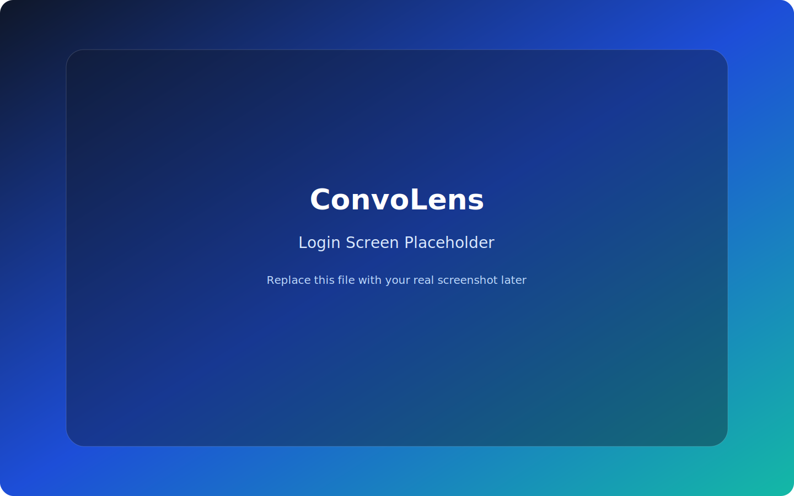
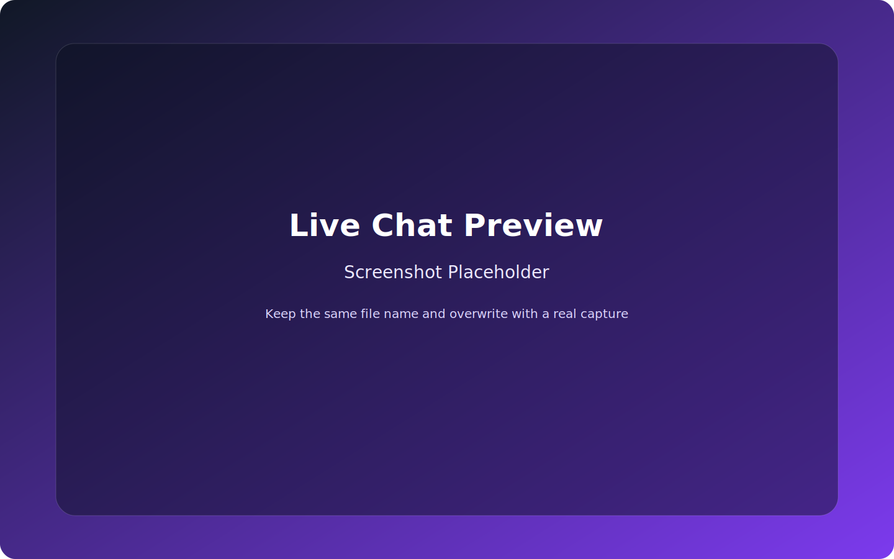
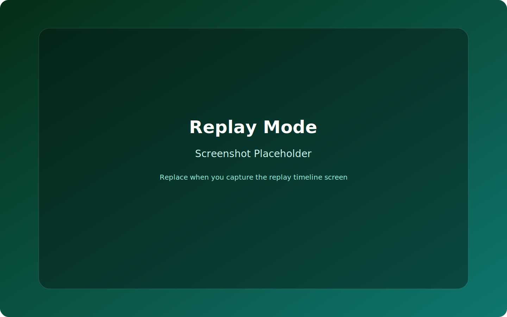
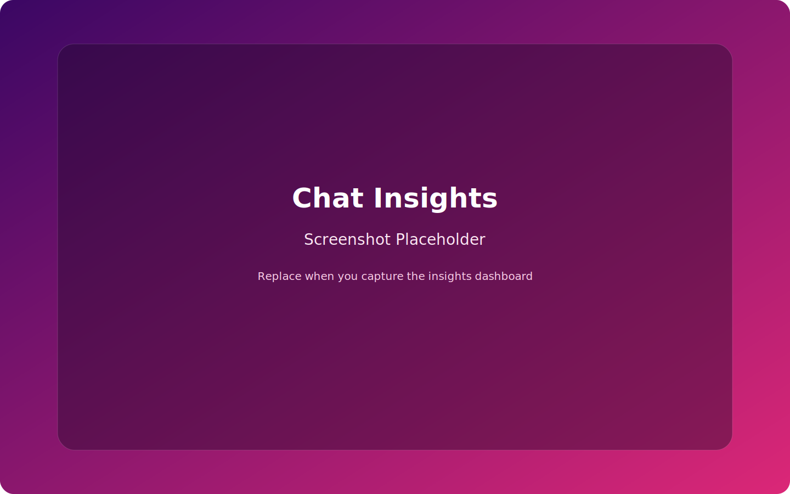

# 🚀 ConvoLens
### *See Conversations Differently.*

> A premium, AI-assisted real-time chat application combining secure messaging, live presence, replay, analytics, and polished storytelling visuals — built with React + Firebase.

---

## ✨ Live Demo

🔗 https://slv-webtech.github.io/whatsapp-chats/

---

## 📸 Preview

These preview slots are wired to stable local paths. Replace the SVG placeholders in `screenshots/` with real captures anytime without changing this README.

### Login Screen



### Live Chat



### Replay Mode



### Chat Insights



---

## 🔥 Features

### 💬 Real-Time Chat

- ⚡ Instant messaging with Firebase Firestore
- 🔄 Live message sync without refresh
- 🧑‍🤝‍🧑 Shared-room experience using a common secret
- ✅ Delivered and read state tracking
- 😀 Emoji reactions on messages

---

### 🔐 Secure Messaging

- 🔑 Client-side AES encryption using CryptoJS
- 🔒 Message content stored encrypted in Firestore
- 🛡️ Shared-secret room access flow
- 👤 Encrypted display-name metadata for presence, typing, and sender labels
- 🧹 Legacy plaintext metadata scrub utility for old room records

---

### 🟢 Live Presence System

- 🟢 Online / offline status
- 🕒 Last seen tracking
- ⌨️ Typing indicator with debounce protection
- 🔄 Presence heartbeat updates for active sessions

---

### 🎨 Premium UI/UX

- 💎 Premium full-screen messaging layout
- 🌈 Dual chat modes: Formal and Romantic
- 🌙 Light / Dark / System theme support
- 🖼️ Curated wallpaper presets plus custom background upload
- 📱 Responsive mobile-first composer and header controls
- 🔔 Incoming notification sound with gesture unlock fallback

---

### 🎬 Chat Replay System

- ⏯️ Replay conversations like a timeline
- ⏩ Adjustable playback speed
- 🎯 Jump to any point in the conversation
- 🧭 Replay from a selected message

---

### 🧠 Chat Intelligence

- 📊 Insights dashboard for conversation analysis
- 🤖 AI-powered summarization support
- 🧩 Local fallback summary flow when external AI is unavailable
- ❌ In-view close action for returning from analysis back to chat

---

### 🔍 Search & Navigation

- 🔎 Keyword search with match highlighting
- ⬆️⬇️ Next / previous result navigation
- 📍 Scroll-to-match behavior in long chats
- 🗂️ Virtualized rendering for larger conversations

---

### 📤 Import / Export

- 🖼️ Export the rendered chat as PNG
- 📄 Parse exported WhatsApp chat files
- 📁 Background and avatar upload support
- 🗑️ Permanent Firebase room data deletion from Settings

---

### 📲 PWA & Installability

- 📦 Web manifest included
- 🧭 App icons and installable app metadata configured
- ⚙️ Service worker included for install-ready deployment base

---

## 🛠️ Tech Stack

| Tech               | Usage                            |
| ------------------ | -------------------------------- |
| React 18           | Frontend UI                      |
| Vite               | Build tool and dev server        |
| Tailwind CSS       | Styling system                   |
| Firebase Auth      | Anonymous authentication         |
| Firebase Firestore | Real-time database               |
| Redux Toolkit      | Session and app state            |
| redux-persist      | Persisted session storage        |
| CryptoJS           | AES encryption                   |
| Framer Motion      | Animations                       |
| react-virtuoso     | Virtualized large chat rendering |
| html-to-image      | PNG export                       |

---

## 🌟 Highlights

- 🔥 Frontend-first architecture with Firebase backend services
- 🔐 Encrypted chat content plus encrypted identity metadata
- ⚡ Handles long conversations efficiently with virtualization and replay controls
- 💎 Premium UI with polished motion, wallpaper layering, and responsive controls
- 🧠 Combines messaging, replay, insights, export, and AI summary in one app

---

## 📌 Use Cases

- 💬 Private shared-secret messaging
- 📊 Chat analysis and behavioral insights
- 🎬 Conversation replay and storytelling demos
- 🧪 UI/UX experimentation with premium messaging layouts
- 📁 Viewing and exploring exported chat archives

---

## ⚙️ Setup Instructions

### 1. Clone the Repository

```bash
git clone https://github.com/Slv-WebTech/whatsapp-chats.git
cd whatsapp-chats
```

---

### 2. Install Dependencies

```bash
npm install
```

---

### 3. Add Environment Variables

Create `.env.local` and add:

```env
VITE_FIREBASE_API_KEY=your_key
VITE_FIREBASE_AUTH_DOMAIN=your_domain
VITE_FIREBASE_PROJECT_ID=your_project
VITE_FIREBASE_STORAGE_BUCKET=your_bucket
VITE_FIREBASE_MESSAGING_SENDER_ID=your_sender_id
VITE_FIREBASE_APP_ID=your_app_id

# Optional AI settings
VITE_OPENAI_API_KEY=your_openai_key
VITE_OLLAMA_BASE_URL=http://127.0.0.1:11434
VITE_OLLAMA_MODEL=llama3.2:3b

# Optional custom notification sound URL
VITE_MESSAGE_TONE_URL=
```

---

### 4. Enable Firebase Services

Firebase project requirements:

- Enable **Anonymous Authentication**
- Enable **Cloud Firestore**
- Configure Firestore rules for authenticated access

---

### 5. Run the App

```bash
npm run dev
```

---

### 6. Build for Production

```bash
npm run build
```

---

## 🔐 Example Firestore Rules

Use rules appropriate for your project. A simple authenticated setup looks like this:

```js
rules_version = '2';
service cloud.firestore {
  match /databases/{database}/documents {
    match /rooms/{roomId} {
      allow read, write: if request.auth != null;

      match /messages/{messageId} {
        allow read, write, delete: if request.auth != null;
      }

      match /typing/{typingId} {
        allow read, write, delete: if request.auth != null;
      }

      match /users/{userId} {
        allow read, write, delete: if request.auth != null;
      }
    }
  }
}
```

Note:

- The hard-delete setting requires delete permission for room subcollections.

---

## 🧭 Core Product Flows

### Shared-Secret Login

Users enter:

- Display name
- Common room password

The app derives a shared room id from the secret and joins the same live conversation.

### Live Messaging

- Messages are encrypted before writing to Firestore
- Other participants receive live updates instantly
- Delivery and read state update automatically

### Insights & Summary

- Open chat analysis from the header menu
- View conversation insights
- Return to chat with the in-view close button

### Danger Zone Delete

From Settings, a user can permanently remove current-room Firebase data:

- messages
- typing docs
- presence docs
- room parent document when available

This is a real delete, not a soft clear.

---

## 📁 Project Structure

```text
src/
├── App.js
├── main.js
├── index.css
├── components/
│   ├── ChatBubble.js
│   ├── ChatHeader.js
│   ├── ChatInsights.js
│   ├── FileUpload.js
│   ├── LiveComposer.js
│   ├── ReplayControls.js
│   ├── SecretLogin.js
│   ├── SettingsPanel.js
│   └── ui/
├── firebase/
│   ├── chatService.js
│   └── config.js
├── store/
│   ├── appSessionSlice.js
│   └── store.js
└── utils/
    ├── aiSummary.js
    ├── encryption.js
    ├── groupMessages.js
    ├── highlight.js
    └── parser.js
```

---

## 🚀 Deployment

Production build is deployed to GitHub Pages:

🔗 https://slv-webtech.github.io/whatsapp-chats/

If you deploy under another base path, ensure Vite base/public asset paths remain aligned.

---

## 🧪 Manual Test Checklist

Use this after deployment:

- Send and receive realtime messages between two sessions
- Verify delivered and read ticks update
- Tap once, then verify incoming notification sound plays
- Confirm shared-secret login lands both users in the same room
- Open insights, then close with the `X` button
- Check mobile composer icon sizing and wallpaper layering
- Delete current-room chat data from Settings and verify Firebase data is gone

---

## 🔮 Future Improvements

- 📞 Voice / video calling
- 🌐 Multi-room management UI
- 🤖 Richer AI insight cards and timeline summaries
- 📎 Better media attachment support
- 🔐 Stronger key exchange model beyond shared-secret entry

---

## 👨‍💻 Author

**Vivek Sharma**  
Full Stack Developer

---

## ⭐ Show Some Love

If you like this project:

- ⭐ Star the repo
- 🍴 Fork it
- 📢 Share it

---

## 📄 License

MIT License
isReplaying={false} // Playback state
currentMessageIndex={0}
onMessageIndexChange={handler}
/>

```

## 🐛 Troubleshooting

### Background not showing

- Verify background URL is accessible
- Check that chatMode matches background's chatMode property
- Ensure theme (light/dark) matches background's mode property

### Chat not replaying

- Verify chat file format is supported
- Check browser console for parsing errors
- Ensure messages array is not empty

### Avatar not updating

- Clear browser cache
- Try uploading again with different image format
- Check image file size (should be < 5MB)

### Performance issues

- Reduce number of messages displayed at once
- Clear chat history and start fresh
- Try dark theme for reduced eye strain
- Close other browser tabs to free up resources

## 📞 Support

For issues, suggestions, or contributions:

1. Open an issue on GitHub
2. Include screenshots or error logs
3. Describe steps to reproduce
4. Specify your browser and OS

## 📄 License

This project is licensed under the MIT License - see the LICENSE file for details.

## 🙏 Acknowledgments

- Built with React and modern web technologies
- Icons by Lucide
- Animations by Framer Motion
- Styling with Tailwind CSS

## 🔄 Version History

### v1.0.0 (Current)

- ✅ Dual chat modes (Formal/Romantic)
- ✅ 24+ background presets with mode filtering
- ✅ Light/Dark/Auto theme support
- ✅ Chat replay with zoom & speed controls
- ✅ Multiple participants with avatars
- ✅ 100+ edge case handlers
- ✅ Comprehensive documentation

---

**Made with ❤️ for seamless, customizable chat experiences**

**Live Demo**: https://slv-webtech.github.io/whatsapp-chats/
**GitHub**: https://github.com/Slv-WebTech/whatsapp-chats
```
